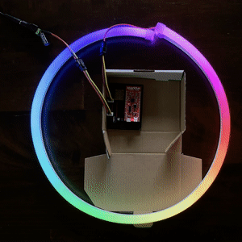
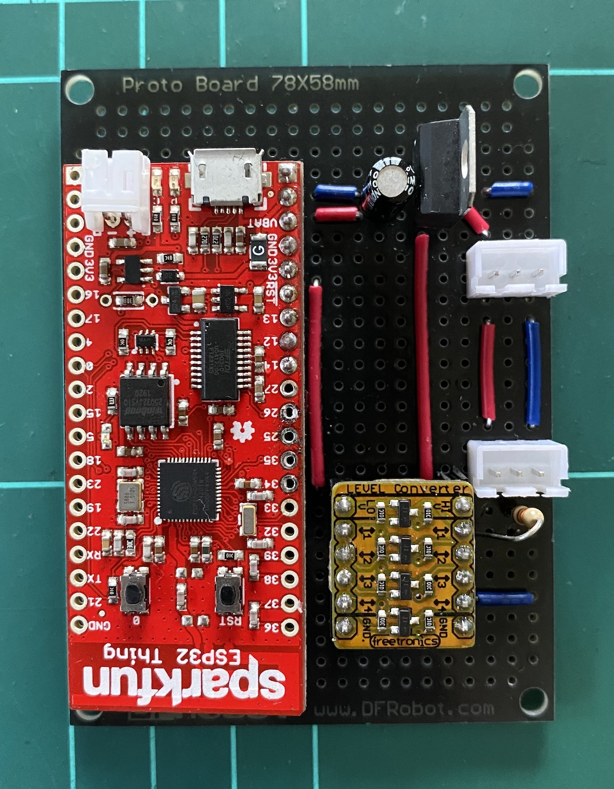

# esp32-lamp

A hobby project for an ESP32 powered LED (NeoPixel/WS2811) lamp.

Please be aware that this project is currently a **work in progress**. So there shouldn't be much worth copying or reusing in other projects at this stage.

---

## Goals

- Typical lighting controls
- Animated lightning
- Control over Bluetooth via iOS app
- Control using HomeKit (WiFi) via third-party bridge

## Build

- [ESP32 Thing](https://www.sparkfun.com/products/13907)
- [NeoPixel (WS2811) strip](https://www.adafruit.com/product/3869)
- Custom prototype board for power and data
- [MicroPython](http://micropython.org) on the ESP32

---

## Table of Contents

- [TODO.md](TODO.md) - What I'm currently working on.
- [BOARD.md](BOARD.md) - Information about the components and layout of the prototype board.
- [NOTES.md](NOTES.md) - Collection of important details about the setup and development of the project.

---

Thanks to [@jim_mussared](https://twitter.com/jim_mussared) for helping with MicroPython setup.
